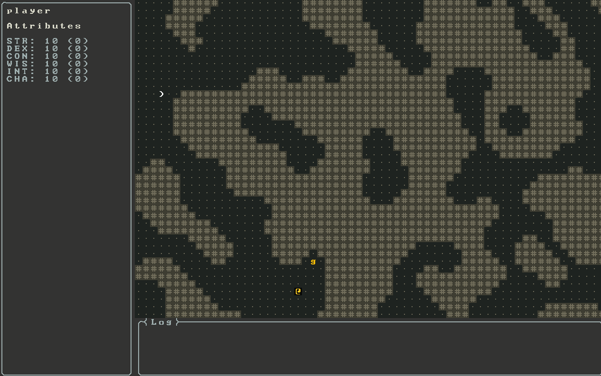

# Undermountain

A roguelike game in development, using [Zircon](https://github.com/Hexworks/zircon) engine and based on the Undermountain setting of *Dungeons & Dragons*.

## Roadmap

- Creature attributes
- Menus
    - Inventory   
    - Character 
    - Spells
- Picking up and using items
- Casting spells
- Combat with creatures
- Earning experience and leveling up
- Character creation
- Map generation
- Monster AI
